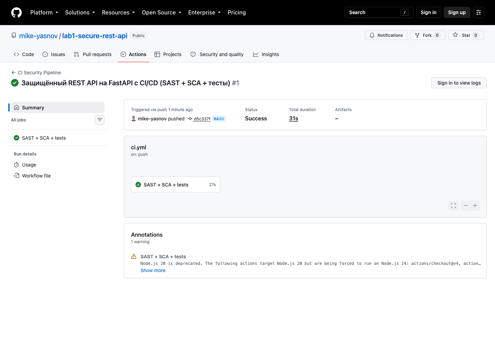
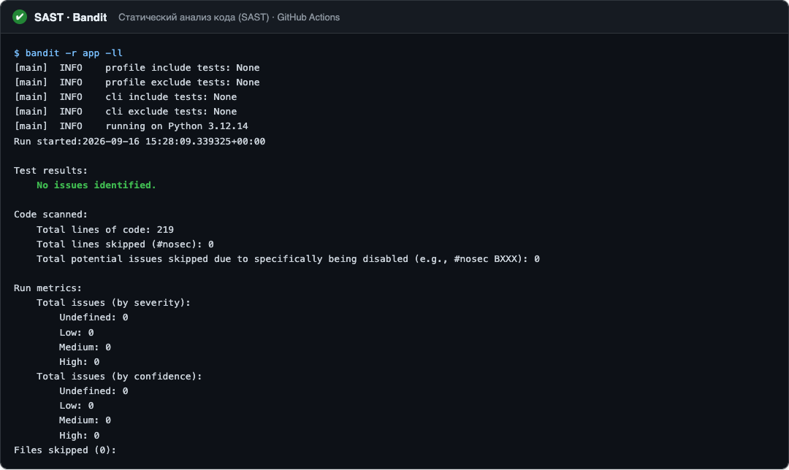
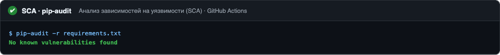
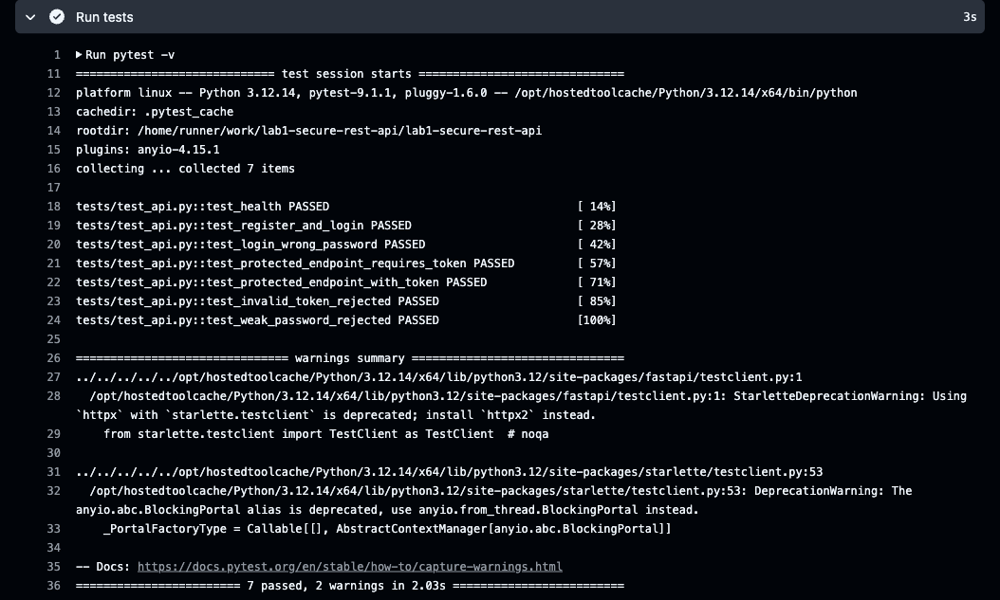

# Secure REST API с интеграцией в CI/CD

REST API на FastAPI: четыре рабочих эндпоинта, защита от SQL-инъекций, XSS и
уязвимостей аутентификации, плюс конвейер CI/CD, который на каждый push
прогоняет статический анализ кода, проверку зависимостей и тесты.

Проект сделан по дисциплине **«Информационная безопасность»** (Университет ИТМО),
работа №1. Закрывает три пункта **OWASP Top 10**:

- A03:2021 — Injection (SQL-инъекции и XSS);
- A07:2021 — Identification and Authentication Failures (уязвимости аутентификации).

---

## Стек технологий

| Компонент | Технология |
|-----------|-----------|
| Язык | Python 3.12+ |
| Веб-фреймворк | FastAPI |
| ORM / БД | SQLAlchemy + SQLite |
| Аутентификация | JWT (PyJWT) |
| Хэширование паролей | bcrypt |
| Тесты | pytest |
| SAST | Bandit |
| SCA | pip-audit |
| CI/CD | GitHub Actions |

---


## Установка и запуск

```bash
# 1. Клонировать репозиторий
git clone https://github.com/mike-yasnov/lab1-secure-rest-api.git
cd lab1-secure-rest-api

# 2. Создать виртуальное окружение и поставить зависимости
python -m venv .venv
source .venv/bin/activate        # Windows: .venv\Scripts\activate
pip install -r requirements-dev.txt

# 3. Задать секрет для подписи JWT
export SECRET_KEY="$(python -c 'import secrets; print(secrets.token_urlsafe(32))')"

# 4. Запустить сервер
uvicorn app.main:app --reload
```

После запуска доступны:

- API: <http://127.0.0.1:8000>
- Интерактивная документация Swagger UI: <http://127.0.0.1:8000/docs>

---

## Описание API

| Метод | Эндпоинт | Аутентификация | Назначение |
|-------|----------|:--------------:|-----------|
| `POST` | `/auth/register` | — | Регистрация пользователя |
| `POST` | `/auth/login` | — | Вход, выдача JWT-токена |
| `GET` | `/api/data` | **JWT** | Получить список постов |
| `POST` | `/api/posts` | **JWT** | Создать пост |
| `GET` | `/health` | — | Проверка доступности |

### Примеры вызовов (curl)

Регистрация:

```bash
curl -X POST http://127.0.0.1:8000/auth/register \
  -H 'Content-Type: application/json' \
  -d '{"username":"mike","password":"S3curePass!"}'
```

Вход и получение токена:

```bash
curl -X POST http://127.0.0.1:8000/auth/login \
  -H 'Content-Type: application/json' \
  -d '{"username":"mike","password":"S3curePass!"}'
# -> {"access_token":"<JWT>","token_type":"bearer"}
```

Создание поста с токеном:

```bash
curl -X POST http://127.0.0.1:8000/api/posts \
  -H "Authorization: Bearer <JWT>" \
  -H 'Content-Type: application/json' \
  -d '{"title":"Заголовок","content":"Текст поста"}'
```

Без токена защищённый эндпоинт отдаёт 401:

```bash
curl -i http://127.0.0.1:8000/api/data           # HTTP 401 Unauthorized
curl http://127.0.0.1:8000/api/data -H "Authorization: Bearer <JWT>"   # 200 OK
```

---

## Меры защиты

### Защита от SQL-инъекций

Все запросы к базе идут через ORM SQLAlchemy, значения подставляются
параметрами. Конкатенации строк в SQL нет нигде. Поиск пользователя выглядит так:

```python
db.query(User).filter(User.username == payload.username).first()
```

SQLAlchemy сам экранирует `payload.username`, поэтому ввод `' OR 1=1 --` попадёт
в запрос обычной строкой и командой уже не станет. Вдобавок Pydantic-схема
пропускает в логине лишь символы `[A-Za-z0-9_]`, так что спецсимволы отсекаются
ещё до обращения к базе.

### Защита от XSS

Заголовок и текст поста экранируются перед записью функцией `sanitize()`
([app/sanitize.py](app/sanitize.py)) поверх `html.escape`:

```python
Post(title=sanitize(payload.title), content=sanitize(payload.content), ...)
```

Нагрузка `<script>alert(1)</script>` сохранится как
`&lt;script&gt;alert(1)&lt;/script&gt;` и не выполнится у клиента, который рисует
ответ как HTML.

### Защита от уязвимостей аутентификации

- пароли хранятся только bcrypt-хэшем со случайной добавкой, уникальной для
  каждого пароля; при входе сверка идёт через `bcrypt.checkpw` за постоянное время;
- после входа сервер выдаёт подписанный JWT (HS256) со сроком жизни 30 минут;
- зависимость `get_current_user` проверяет подпись и срок токена на всех
  защищённых эндпоинтах; если токена нет или он просрочен, сервер отвечает 401;
- секрет подписи читается из переменной окружения `SECRET_KEY`, в коде его нет.

---

## Конвейер CI/CD (GitHub Actions)

Конфиг лежит в [.github/workflows/ci.yml](.github/workflows/ci.yml). Запускается
на каждый push и pull request, три шага:

1. Bandit — статический анализ исходного кода на уязвимости (SAST);
2. pip-audit — проверка зависимостей на известные уязвимости, CVE (SCA);
3. pytest — функциональные тесты API.

Любая найденная уязвимость или упавший тест красит прогон в красный.

### Скриншоты отчётов SAST/SCA (вкладка Actions)

Общий результат прогона, все шаги зелёные:



Шаг SAST (Bandit), уязвимостей не найдено:



Шаг SCA (pip-audit), уязвимых зависимостей не найдено:



Шаг тестов (pytest), все тесты пройдены:



---

## Автор

Яснов Михаил Андреевич, группа Р3417.
